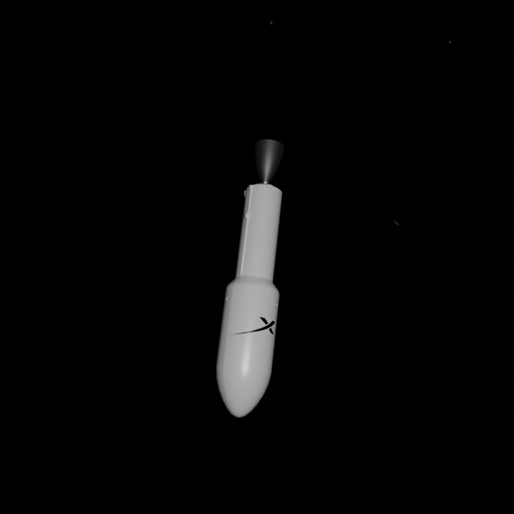
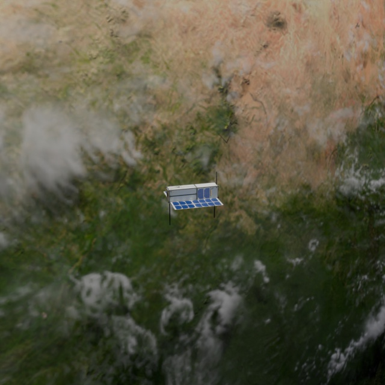
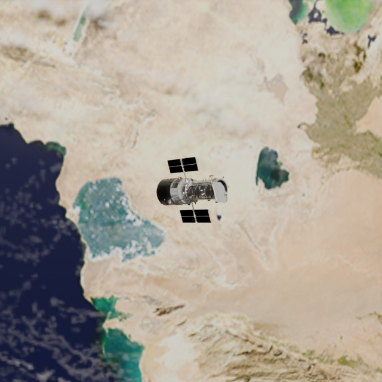
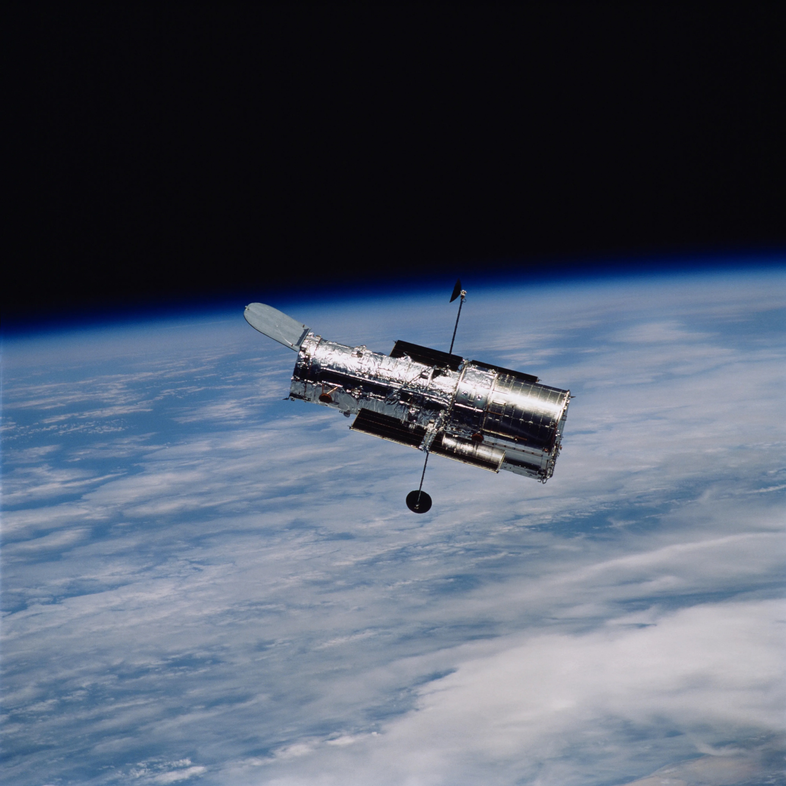
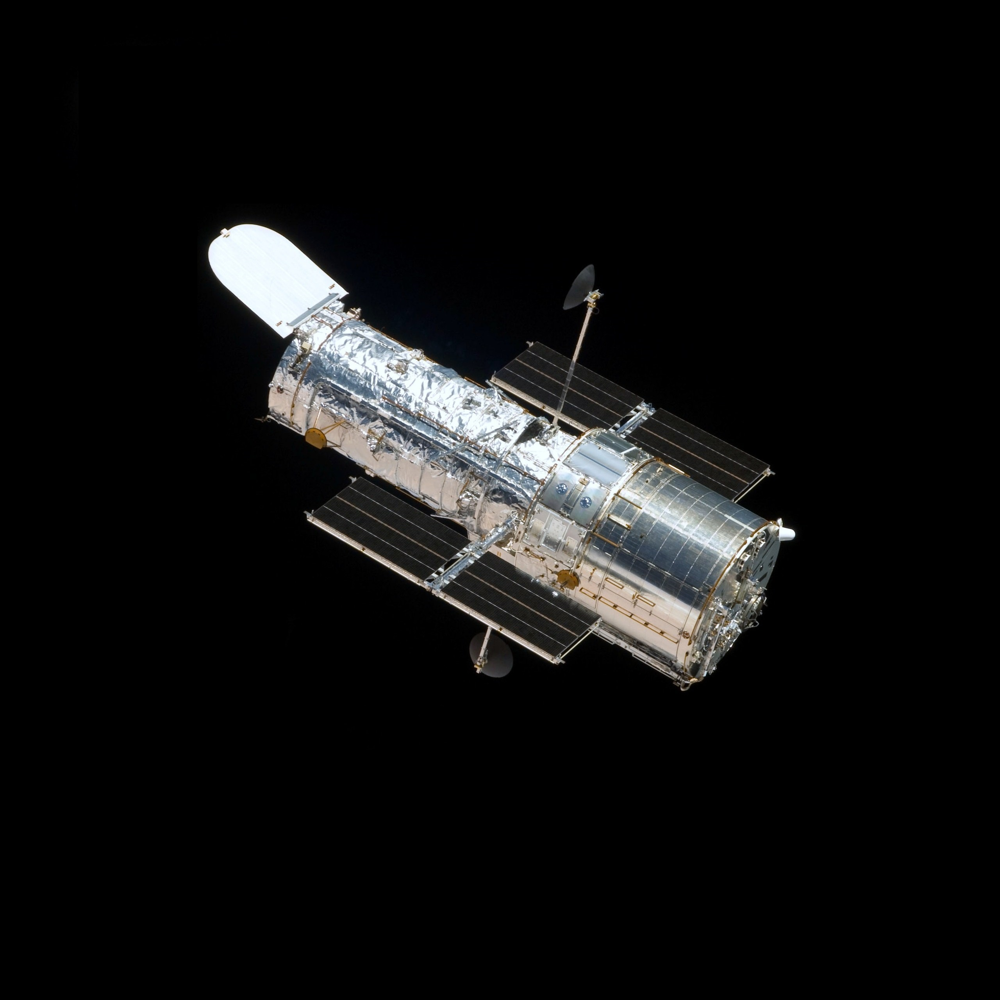
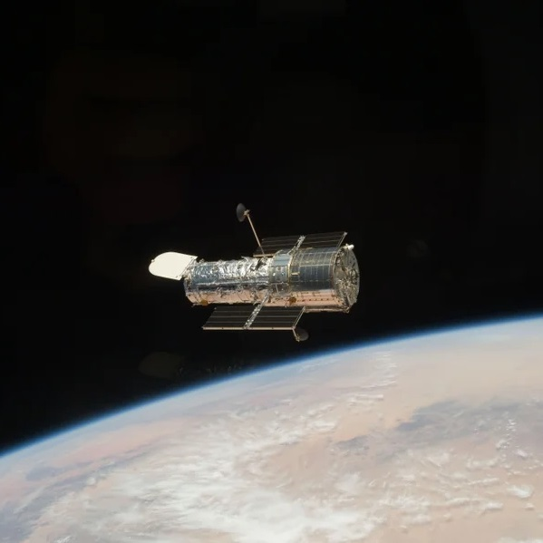

# Space Debris Detection Pipeline

[](https://www.python.org/)
[](https://www.blender.org/)
[](LICENSE)
[](https://wandb.ai/)
[](https://github.com/jaikr-dev/space-debris-detection-pipeline)

<p align="left">
    
</p>

## 🌟 Highlights

- **End-to-end pipeline** for space debris detection using synthetic images, computer vision, and deep learning, designed to address the lack of labeled datasets and high cost of real-world data collection.
- **Scalable synthetic image generation** with Blender’s Python API. 1000 images? Yes! 10,000 images? No problem! 100,000 images? Absolutely. Easily generates labelled, photorealistic training data to simulate space debris in orbit.
- **Advanced domain randomisation and image augmentation techniques** to replicate real-world space imaging challenges.
- **Training YOLO models** (YOLOv8n, YOLOv11n, YOLOv12n) with full Weights & Biases integration for experiment tracking and benchmarking.
- **Optimized for lightweight deployment,** with a focus on models suited for constrained environments like Active Debris Removal spacecraft (limited volume, mass, power, and cost).
- **Real-world inference capability,** validating that models trained on synthetic images can successfully detect debris in real-world space imagery.

## 📋 Overview

The Space Debris Detection Pipeline is a complete, modular framework for detecting and classifying space debris using synthetic imagery, computer vision, and deep learning. Designed to address the scarcity of labeled space debris datasets and the high cost of real data collection, it integrates scalable synthetic image generation with Blender, advanced augmentation techniques, and a streamlined detection system built around the YOLO family of models. The pipeline enables training on large-scale, photorealistic datasets and demonstrates real-world inference capability, paving the way for robust, resource-efficient debris detection in Active Debris Removal missions.

## ✍️ Author
I'm Jai, and I built this project out of a deep fascination with space technology and a curiosity about how AI can be applied to solve real-world problems. It started as a university project but quickly became a personal mission to explore how synthetic data and deep learning can work together in a practical, meaningful way.

Along the way, I learned a ton - about space, technology, and myself. I saw firsthand what it takes to turn a single idea into a fully working system (woah). I hope this repository helps others on a similar path or sparks new ideas in the process.

## 🚀 Motivation

Space debris poses an escalating threat to satellites, human missions, and the long-term sustainability of space operations. As thousands of objects continue to accumulate in Earth’s orbit, the risk of collisions grows, and so does the urgency to monitor and manage debris effectively. This project was inspired by my fascination with space technology and computer vision, and by a desire to contribute meaningful tools to the field of space situational awareness using modern AI.

Nearly 50 years ago, NASA scientist Donald Kessler warned: “Keep cluttering up space, and we'll eventually lock ourselves out of it.” That warning feels more real than ever today. With the high costs and scarcity of real-world debris data, I saw an opportunity to create a scalable, affordable solution: one that blends synthetic image generation and deep learning to help push the boundaries of real-time space debris detection.

## 🔍 Project Structure

```
space-debris-detection-pipeline/
├── ASSETS/                  # General assets (e.g., fonts, background images) for documentation and plots
├── BLENDER_ASSETS/          # Blender resources for synthetic image generation
│   ├── blender_files/       # Blender model (.blend) and Python API script for automated rendering
│   └── debris_models.zip/   # 3D debris models (.obj, .fbx, .glb) used in scene setup
├── ML_ASSETS/               # Machine learning assets for dataset storage and model outputs
│   └── dataset/             # Dataset directories and results
│       ├── Debris/          # Raw dataset (images and YOLO-format annotations)
│       ├── Debris_Scaled/   # Scaled dataset, augmentations, YOLO configs, and training outputs
│       ├── Results/         # Evaluation results, plots, and confusion matrices
│       └── ...              # Additional metadata and coordinate files
├── TECHNICAL_DOCUMENT/      # Technical report
├── environment.yml          # Conda environment specification for full reproducibility
├── main.ipynb               # Jupyter notebook implementing the full detection pipeline
├── main.py                  # Python script version of the pipeline (standalone execution)
└── requirements.txt         # Python package requirements (for pip-based setups)
```

## 🖼️ Examples

### Synthetic Test Image Examples
<p float="left">
  
  
  
</p>

### Real-world Test Image Examples
<p float="left">
  
  
  
</p>

### Inference Examples
Synthetic images with bounding box predictions (YOLOv8n, YOLOv11n, and YOLOv12n):
<p float="left">
  
  
  
</p>
Real-world images with bounding box predictions (YOLOv8n, YOLOv11n, and YOLOv12n):
<p float="left">
  
  
  
</p>

## 🛠️ Installation

### Prerequisites

- Python 3.12 or higher.
- CUDA-compatible GPU (for training).
- Blender 4.2 (for data generation).

### Setup with Conda

```bash
# Clone the repository
git clone https://github.com/jaikr-dev/space-debris-detection-pipeline.git
cd space-debris-detection-pipeline

# Create and activate conda environment
conda env create -f environment.yml
conda activate space_debris_detection_pipeline
```

### Setup with pip

```bash
# Clone the repository
git clone https://github.com/jaikr-dev/space-debris-detection-pipeline.git
cd space-debris-detection-pipeline

# Create a virtual environment (optional but recommended)
python -m venv venv
venv\Scripts\activate  # On macOS/Linux: source venv/bin/activate

# Install dependencies
pip install -r requirements.txt
```

## 🚀 Usage

The Space Debris Detection Pipeline is implemented as a Jupyter notebook (`main.ipynb`) with modular functions that can be executed step-by-step. Here's how to use it:

### 1. Configure Your Environment

First, open `main.ipynb` and update the configuration variables:

```python
# Set your project directory path
PROJECT_BASE = r"C:\path\to\your\space-debris-detection-pipeline"

# Set your Blender executable path
BLENDER_EXECUTABLE = r"C:\Program Files\Blender Foundation\Blender 4.2\blender.exe"

# Set your Weights & Biases API key (optional, for tracking experiments)
WANDB_API_KEY = os.getenv('WANDB_API_KEY', "your-api-key-here")
```

### 2. Generate Synthetic Data (Optional)

If you need to create new training data, run the Blender data generation function:

```python
# Uncomment to execute the Blender restart process
restart_blender()
```

This will use Blender to generate synthetic images of space debris with automatic annotations.

### 3. Preprocess the Dataset

Prepare your dataset for training:

```python
# Resize images to 640x640 and organize dataset structure
resize_and_scale_dataset()

# Visualize bounding boxes to verify annotations (optional)
visualize_bounding_boxes()

# Apply augmentations to enhance the dataset
apply_augmentations()
```

### 4. Train the Model

Train a YOLO model on your prepared dataset:

```python
# Train with default settings (100 epochs, batch size 16)
train_and_log_model()

# Or customize training parameters
train_and_log_model(epochs=50, batch_size=8)
```

The training process includes:
- GPU utilization check.
- Weights & Biases integration for experiment tracking.
- Automatic saving of best weights.
- Confusion matrix generation.

### 5. Run Inference

Detect space debris in new images:

```python
# Run with default settings
results = run_inference()

# Or specify a model path and confidence threshold
results = run_inference(
    model_weight_path="ML_ASSETS/dataset/Debris_Scaled/your-run-name/weights/best.pt",
    confidence_threshold=0.60
)
```

Inference results will be saved to the specified output directory with bounding boxes drawn around detected debris.

### 6. Evaluate Results

Analyze model performance using the evaluation functions:

```python
# Method 1: Evaluate during training (automatically called by train_and_log_model)
# This is done in the extract_confusion_matrix function
model, run_dir = train_yolov8_model(epochs=100, batch_size=16)
extract_confusion_matrix(model, run_dir)

# Method 2: Evaluate an existing model
model = YOLO("ML_ASSETS/dataset/Debris_Scaled/your-run-name/weights/best.pt")
results = model.val(
    save_json=True,
    device=0,
    project=DEBRIS_SCALED_DIR,
    name="Model Validation"
)

# Method 3: Compare multiple models using the confusion_matrices function
# First ensure your confusion matrix paths are set correctly:
CONFUSION_MATRIX_8 = os.path.join(DEBRIS_SCALED_DIR, "your-yolov8-run/confusion_matrix_raw.csv")
CONFUSION_MATRIX_11 = os.path.join(DEBRIS_SCALED_DIR, "your-yolov11-run/confusion_matrix_raw.csv")
CONFUSION_MATRIX_12 = os.path.join(DEBRIS_SCALED_DIR, "your-yolov12-run/confusion_matrix_raw.csv")

# Then run the visualization function
confusion_matrices()
```

The evaluation process will generate:
- Confusion matrices showing true vs. predicted classes.
- Precision, recall, and mAP metrics.
- Visualizations saved to your output directory.

### 7. Visualize Data and Results

Generate visualizations of the dataset and model performance:

```python
# Visualize debris coordinates in 3D space
x_vals, y_vals, z_vals = load_coordinates(ORBIT_CONTAINER_COORDINATES)
occ_fig = plot_3d_scatter(x_vals, y_vals, z_vals,
                         title='Debris position relative to Earth',
                         marker_size=15, alpha=0.8)

# Visualize debris orientation using quaternions
w_vals, x_vals, y_vals, z_vals = load_debris_quaternion_coordinates(QUATERNION_COORDINATES)
qc_fig = plot_3d_quaternion_scatter(w_vals, x_vals, y_vals, z_vals,
                                   title='Debris Orientation (Quaternion)',
                                   marker_size=15, alpha=0.8)

# Visualize debris orientation using Euler angles
roll_vals, pitch_vals, yaw_vals = load_coordinates(EULER_COORDINATES)
ec_fig = plot_euler_angle_scatter(roll_vals, pitch_vals, yaw_vals,
                                 title='Debris Orientation (Euler)',
                                 marker_size=15, alpha=0.8)

# Visualize augmentation statistics
as_fig = plot_augmentation_summary(AUGMENTATION_SUMMARY,
                                  title="Augmentation Summary",
                                  bar_color='gray')

# Save all visualizations as high-quality images
occ_fig.savefig("Orbit_Container_Plot.png", dpi=300, bbox_inches='tight')
qc_fig.savefig("Debris_Orientation_Quaternion.png", dpi=300)
ec_fig.savefig("Debris_Orientation_Euler.png", dpi=300)
as_fig.savefig("Augmentation_Summary_Plot.png", dpi=300)
```

These visualizations help understand:
- The spatial distribution of debris in orbit.
- The orientation patterns of different debris types.
- The effectiveness of various augmentation techniques.
- The performance of different models on each debris class.


## 📊 Results

The space debris detection pipeline achieves the following performance metrics:

- **YOLOv8n**: mAP50-95 = 0.976
- **YOLOv11n**: mAP50-95 = 0.976
- **YOLOv12n**: mAP50-95 = 0.969

## 🐛 Known Issues & Limitations

- The pipeline currently supports the generation and detection of four specific debris types: Satellite, Envisat, Hubble, and Falcon 9 F&S.
- The synthetic image dataset has a positional bias (debris mostly centered), which reduces detection confidence for off-center objects.
- No quantitative validation for photorealism due to the lack of real space imagery.
- The Blender model does not simulate atmospheric scattering.
- The Blender data generation process can be time-consuming for large datasets.

## 🔮 Future Work

- Expand debris types to include smaller orbital fragments.
- Implement tracking capabilities for moving debris.
- Increase synthetic image dataset variability:
    - Remove positional bias.
    - Include multiple debris objects per image.
- Improve synthetic image photorealism by incorporating advanced rendering effects (lens glare, atmospheric scattering, etc.).
- Generate segmentation masks for space debris to enable pixel-level understanding.
- Quantize YOLO models for deployment on resource-constrained devices.

## 📄 License

This project is licensed under the Apache License 2.0 - see the [LICENSE](LICENSE) file for details.

## 📝 Closing Notes
Long read, but I hope you found it interesting! If you have any questions or feedback, feel free to reach out. I’m always open to learning and improving.

Wishing you clear skies and smooth orbits!
